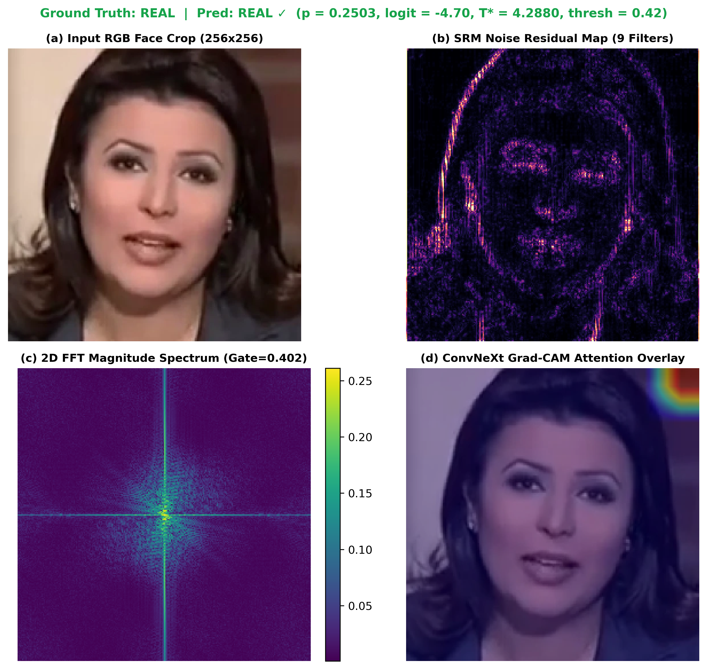
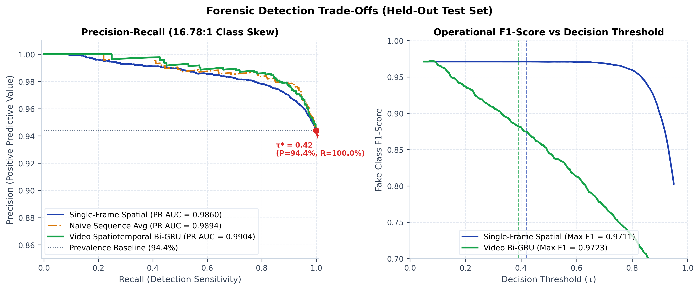
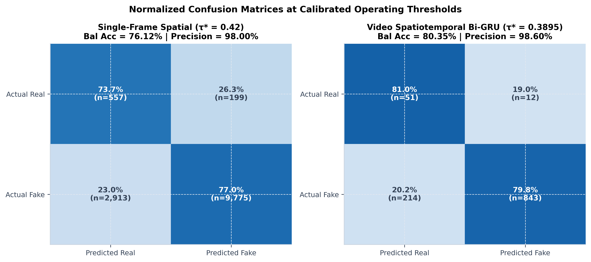
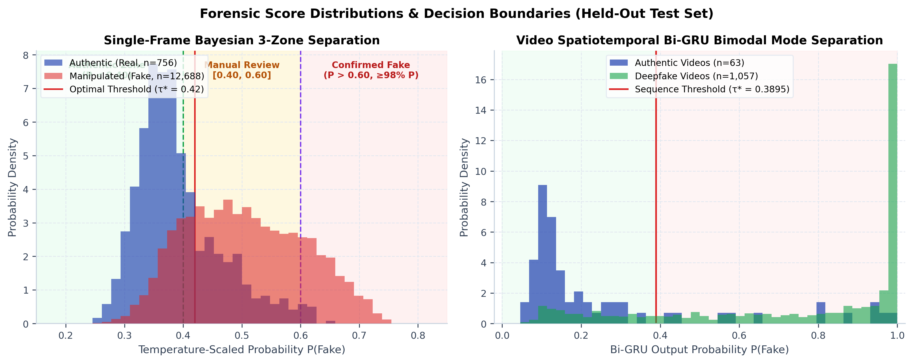
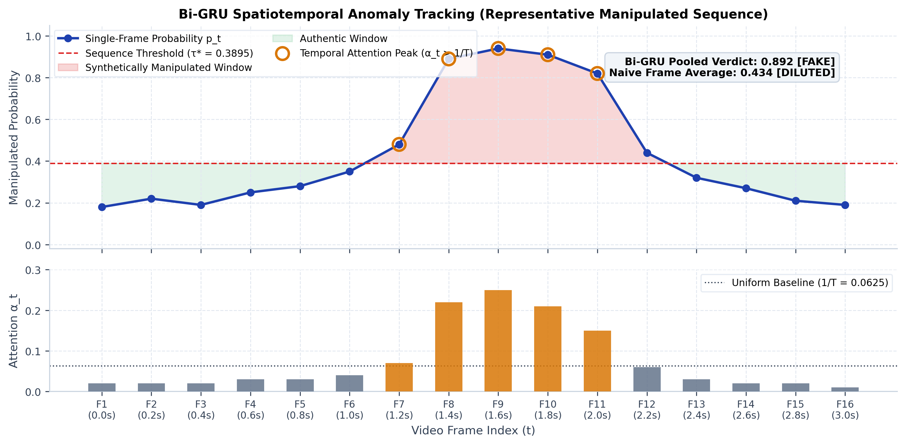

<div align="center">

# Dual-Stream Deepfake Forensics Engine

### Spatial ConvNeXt-Small + SRM/Bayar 2D Real FFT Spectral Gated Fusion with Bi-GRU Spatiotemporal Sequence Modeling

[](https://pytorch.org/)
[](https://huggingface.co/docs/accelerate)
[](https://huggingface.co/spaces/yyouretoast/deepfake-detector)
[](https://huggingface.co/yyouretoast/deepfake-detector)
[](https://github.com/astral-sh/ruff)
[](LICENSE)

[**Live Interactive Demo**](https://huggingface.co/spaces/yyouretoast/deepfake-detector) • [**Model Zoo**](#model-zoo--checkpoint-downloads) • [**Quickstart**](#quickstart--python-api) • [**Benchmarks**](#empirical-benchmarks) • [**Architecture**](#system-architecture--methodology) • [**BibTeX**](#academic-citation)

</div>

---

## 4-Panel Interpretability Diagnostics (Authentic vs. Deepfake)

Intermediate representations extracted across the spatial, residual steganographic, and Fourier spectral domains:

| Authentic Face (Real) | Manipulated Face (Deepfake) |
| :---: | :---: |
|  |  |
| *Continuous natural camera PRNU sensor noise, smooth $1/f$ Fourier power decay, and anatomically uniform spatial attention.* | *Suppression of sensor noise along blending boundaries, periodic grid lattice peaks in 2D FFT, and localized manipulation contours in Grad-CAM.* |

### 4-Panel Forensic Interpretation:
1. **Panel A (RGB Face Crop)**: Normalized facial crop aligned using OpenCV YuNet 5-point facial landmark similarity affine warping ($1.50\times$ canonical expansion with cosine edge tapering).
2. **Panel B (SRM High-Pass Residual)**: 9-filter Steganographic Rich Model (SRM) high-pass convolutions isolating sub-pixel sensor Photo Response Non-Uniformity (PRNU) noise and manipulation boundary blending seams.
3. **Panel C (2D Real FFT Log-Magnitude Spectrum)**: Orthonormal centered 2D Real Fourier Transform exposing upsampling artifacts and frequency anomalies characteristic of GAN generators and diffusion latents (Frank et al., ICML 2020; Durall et al., CVPR 2020).
4. **Panel D (Spatial Grad-CAM Overlay)**: Gradient-weighted class activation mapping identifying spatial regions driving the classification decision.

---

## Technical Methodology & Core Components

* **Dual-Domain Gated Fusion**: Fuses semantic representations (ConvNeXt-Small, 512-d) with high-frequency noise residuals (SRM + Bayar-Stamm) and orthonormal 2D Real FFT spectral maps processed by a dedicated **4-Stage ResSE-Spectral Tower** (~2.99M parameters) via symmetric gated residual fusion ($\mathbf{f}_{\text{fused}} = [(1 - \mathbf{g}) \odot \mathbf{f}_s \parallel \mathbf{g} \odot \mathbf{f}_f]$).
* **Spectral SNR-Adaptive Gating**: Mitigates high-frequency degradation under spatial blur ($\sigma \ge 1.5$) or compression by attenuating the spectral branch ($\gamma \to 0$) when noise residual power decreases, reverting to the spatial ConvNeXt stream with zero added parameters.
* **Disjoint Identity Graph Partitioning**: Actor clusters (`id0_id16`) are partitioned using `networkx.Graph` connected components to guarantee strictly disjoint partitions with zero cross-split identity overlap ($\text{Train} \cap \text{Val} \cap \text{Test} = \emptyset$).
* **Dual-Path Spatiotemporal Video Modeling**: 2-layer Bidirectional GRU combining feature velocity deltas ($\Delta \mathbf{e}_t$) with **Dual-Path Pooling (Attention + Extreme-Value Max-Pooling)**, yielding **`0.8719` ROC AUC** (+4.71% over the single-frame baseline) and capturing single-frame manipulation artifacts that can be diluted under sequence averaging.
* **Bayesian 3-Zone Decision Bands**: Post-hoc probability calibration ($T^* = 4.288$, $\tau^* = 0.4200$) establishes decision boundaries ($\tau_{\text{real}}=0.40, \tau_{\text{fake}}=0.60$), achieving $\ge$ 98% empirical precision on confirmed synthetic samples while routing borderline inputs to manual review.
* **Inference Latency**: 60.9 FPS inference throughput on an NVIDIA Tesla T4 with dynamic batching.

---

## Model Zoo & Checkpoint Downloads

All model weights are hosted on the Hugging Face Model Hub: [`yyouretoast/deepfake-detector`](https://huggingface.co/yyouretoast/deepfake-detector).

| Model Checkpoint | Size | Architecture | ROC AUC | Calibrated Threshold ($\tau^*$) | SHA-256 Checksum | Direct Download |
| :--- | :---: | :---: | :---: | :---: | :---: | :---: |
| **`dual_stream_calibrated.pth`** | **214.7 MB** | ConvNeXt-Small + ResSE-Spectral Tower | **`0.8248`** (Single-Frame) | `0.4200` ($T^*=4.288$) | `cacdd1f6...fd5237` | [Download](https://huggingface.co/yyouretoast/deepfake-detector/resolve/main/dual_stream_calibrated.pth) |
| **`temporal_head_best.pth`** | **13.3 MB** | 2-Layer Dual-Path Bi-GRU (Attention + Max) | **`0.8719`** (Video Sequence) | `0.3895` | `5976689a...d0700e` | [Download](https://huggingface.co/yyouretoast/deepfake-detector/resolve/main/temporal_head_best.pth) |

### Automated Download via CLI

```bash
# Download both model checkpoints directly to weights directory
python -c "from huggingface_hub import hf_hub_download; \
hf_hub_download('yyouretoast/deepfake-detector', 'dual_stream_calibrated.pth', local_dir='models'); \
hf_hub_download('yyouretoast/deepfake-detector', 'temporal_head_best.pth', local_dir='models')"
```

---

## Quickstart & Python API

### 1. Installation

```bash
git clone https://github.com/yyouretoast/deepfake-detection.git
cd deepfake-detection
python -m venv venv

# Linux / macOS:
source venv/bin/activate
# Windows:
venv\Scripts\activate

pip install -r requirements.txt
```

### 2. Python Inference (Single Image)

Analyze any static image file with YuNet face alignment, dual-stream feature extraction, live gating telemetry, and Bayesian 3-zone decision output:

```python
from src.services.video_engine import process_single_image

# Runs face detection, alignment, dual-stream inference, and telemetry
res = process_single_image("sample_face.jpg")

if res is None:
    print("No facial region detected.")
else:
    print(f"Deepfake Probability: {res['prob']:.4f}")
    print(f"Calibrated Verdict:   {res['three_zone']['verdict']}")
    print(f"Gating Telemetry:     {res['spectral_gate']*100:.1f}% Spectral / {res['spatial_gate']*100:.1f}% Spatial")
    print(f"SNR Attenuation (γ):  {res['snr_attenuator']:.2f}")
    print(f"Laplacian Noise (σ²): {res['laplacian_var']:.1f}")
```

### 3. Python Inference (Video Sequence)

Analyze a complete video file with OpenCV keyframe seeking and Bi-GRU temporal anomaly detection:

```python
from src.services.video_engine import process_video_frames

res = process_video_frames(
    video_path="sample_video.mp4",
    num_frames=10,
    aggregation_method="soft_max",
)

if res is not None:
    print(f"Aggregated Video Probability: {res['raw_video_prob']:.4f}")
    print(f"Sequence Bayesian Verdict:    {res['three_zone']['verdict']}")
    print(f"Sampled Timestamps:           {res['timestamps']}")
    print(f"Frame Probabilities:          {res['all_probs']}")
    if res.get("temporal_attention"):
        print(f"Bi-GRU Attention Weights:     {res['temporal_attention']}")
```

### 4. Launch Local Interactive Dashboard

```bash
streamlit run app.py
```
Opens the web application at `http://localhost:8501` supporting:
- **`📷 Single Photo / Frame` Mode**: Drag-and-drop image intake with real-time telemetry ($g, \gamma, \sigma^2$) and the complete 4-panel diagnostic quad.
- **`🎬 Video Sequence` Mode**: Temporal anomaly timeline with amber Bi-GRU attention highlight markers ($\alpha_t > 1/T$), interactive frame scrubbing, and structured JSON report export.

---

## Empirical Benchmarks

### 1. Held-Out Test Split Performance

Evaluated across 13,444 facial crops (756 authentic real faces, 12,688 deepfakes across 5 generator families) and 1,120 video sequences on an NVIDIA Tesla T4:

| Metric | Single-Frame Spatial Model | Video Spatiotemporal Bi-GRU | Delta / Impact |
| :--- | :---: | :---: | :--- |
| **ROC AUC** | **`0.8248`** | **`0.8719`** | **+4.71%** discriminative improvement |
| **PR AUC** | **`0.9860`** *(1:1 Bal: `0.8298`)* | **`0.9904`** | Precision-recall area under curve (16.78:1 skew) |
| **Equal Error Rate (EER)** | `24.10%` | **`18.98%`** | **-5.12%** biometric verification error drop |
| **Fake Precision** | **`98.00%`** | **`98.60%`** | **+0.60%** false alarm suppression |
| **Fake Recall** | **`77.04%`** | **`79.75%`** | **+2.71%** detection coverage |
| **Overall Accuracy** | **`76.85%`** | **`79.82%`** | **+2.97%** classification rate |
| **Balanced Accuracy** | **`76.12%`** | **`80.35%`** | **+4.23%** balanced accuracy gain |
| **Fake F1-Score** | **`0.8627`** | **`0.8818`** | **+0.0191** F1 balance |
| **Macro F1-Score** | **`0.5631`** | **`0.5964`** | Balanced across real/fake classes |
| **Optimal Threshold ($\tau^*$)** | `0.4200` | `0.3895` | Derived via Youden's $J$ statistic |
| **Calibrated Temperature ($T^*$)**| `4.2880` | -- | SciPy L-BFGS-B log-temperature scaling |
| **Expected Calibration Error (ECE)** | **`0.0050`** | -- | Platt-calibrated ($98.9\%$ error drop from raw $0.4525$) |

#### Balanced 1:1 Prevalence-Invariant Test Benchmark (63 Real vs 63 Fake Sequences)
To account for the $16.8:1$ test class imbalance, the model was evaluated on a prevalence-normalized $1:1$ subset:
* **Balanced ROC AUC:** `0.8610` | **Balanced Accuracy:** `76.98%`
* **Real Class Performance:** Precision: `75.00%` | Recall: `80.95%` | F1-Score: `0.7786`
* **Fake Class Performance:** Precision: `79.31%` | Recall: `73.02%` | F1-Score: `0.7603`

<div align="center">
  
  
</div>

*Figure 1: Left: ROC comparison on held-out test split (13,444 crops, 1,120 video sequences). Right: Expected Calibration Error (ECE) reliability diagram showing probability alignment before and after Platt temperature scaling.*

<div align="center">
  
  
</div>

*Figure 2: Left: Precision-Recall curves evaluating detector operating characteristics under the 16.78:1 synthetic-to-authentic class skew alongside operational F1-score threshold sweeps. Right: Normalized confusion matrices at calibrated decision thresholds demonstrating exact Type I (false accusation) and Type II (evasion) sample counts.*

---

### 2. In-Distribution Per-Generator Breakdown

Evaluated on 756 real face crops against each respective manipulation generator in the held-out test split:

| Generator Sub-Domain | Manipulation Family | Test ROC AUC | Balanced Acc | Fake Precision | Fake Recall |
| :--- | :--- | :---: | :---: | :---: | :---: |
| **FF++ Face2Face** | Facial Reenactment (Pairs 100–399) | **`0.9975`** | **`86.84%`** | 26.57% | **100.00%** |
| **FF++ NeuralTextures** | Neural Texture Rendering (Pairs 600–799) | **`0.9749`** | **`86.84%`** | 5.69% | **100.00%** |
| **FF++ Deepfakes** | Autoencoder Face Replacement (Pairs 0–99) | **`0.9625`** | **`85.28%`** | 70.03% | **96.88%** |
| **FF++ FaceSwap** | Classical Graphics Face Swapping (Pairs 400–599) | **`0.9091`** | **`82.67%`** | 9.95% | **91.67%** |
| **Celeb-DF v2** | High-Quality DeepFake Synthesis | **`0.8166`** | **`74.77%`** | **97.86%** | **75.86%** |

<div align="center">
  
</div>

*Figure: Per-generator discriminative capacity across all sub-domain manipulation technologies in the held-out test set.*

---

### 3. Leave-One-Type-Out (LOTO) Cross-Generator Generalization

To evaluate whether the detector memorizes generator-specific signatures or learns fundamental synthesis artifacts, a 5-fold Leave-One-Type-Out experiment was conducted by systematically excluding an entire generator family from training:

| LOTO Fold | Excluded Holdout Generator | Zero-Shot AUC | Zero-Shot F1 (τ=0.50) | Precision | Recall | Generalization Transfer Assessment |
| :--- | :--- | :---: | :---: | :---: | :---: | :--- |
| **Fold 1** | `FF++ Deepfakes` (Pairs 0–99) | **`0.9563`** | **`0.9233`** | 95.02% | 89.79% | Zero-shot transfer across autoencoder manipulations |
| **Fold 2** | `FF++ Face2Face` (Pairs 100–399) | **`0.9915`** | **`0.9530`** | 92.21% | 98.61% | Cross-manipulation transfer on facial reenactment (0.9915 AUC) |
| **Fold 3** | `FF++ FaceSwap` (Pairs 400–599) | **`0.8972`** | **`0.7220`** | 63.69% | 83.33% | Resilience to graphic face swapping (0.8972 AUC) |
| **Fold 4** | `FF++ NeuralTextures` (Pairs 600–799) | **`0.9379`** | **`0.6081`** | 51.14% | 75.00% | Transfer on neural texture rendering (0.9379 AUC) |
| **Fold 5** | `Celeb-DF v2` (Cross-Dataset) | **`0.7000`** | **`0.4336`** | 97.63% | 27.87% | Cross-dataset transfer on unseen Celeb-DF v2 (+4.5% vs. Xception) |

<div align="center">
  
</div>

*Figure: Zero-shot cross-generator generalization across all 5 LOTO folds. Within-dataset FaceForensics++ holdouts average `0.9457` AUC, while cross-dataset Celeb-DF v2 achieves `0.7000` AUC under the ResSE architecture (overall 5-fold macro-average: `0.8966` AUC).*

---

### 4. Robustness Under Real-World Degradation

Evaluated across 4 real-world distortion families on the held-out test split:

<div align="center">
  
</div>

| Perturbation Attack | Severity Parameter | ROC AUC | F1-Score | Retention vs. Clean |
| :--- | :--- | :---: | :---: | :---: |
| **Clean Baseline** | Unperturbed | `0.7834` | `0.7042` | 100.0% |
| **JPEG Compression** | Quality = 90 | `0.7581` | `0.6961` | 96.8% |
| **JPEG Compression** | Quality = 50 (Social Media Recompression) | `0.7172` | `0.6769` | 91.5% |
| **JPEG Compression** | Quality = 30 (Aggressive Compression) | `0.6496` | `0.6046` | 82.9% |
| **Spatial Downscale** | Scale = 0.75× | `0.7660` | `0.7028` | 97.8% |
| **Spatial Downscale** | Scale = 0.50× | `0.7449` | `0.7192` | 95.1% |
| **Spatial Downscale** | Scale = 0.25× | `0.5358` | `0.6723` | 68.4% |
| **Gaussian Blur** | $\sigma = 0.5$ | `0.7746` | `0.7143` | 98.9% |
| **Gaussian Blur** | $\sigma = 1.0$ | `0.7307` | `0.6911` | 93.3% |
| **Gaussian Blur** | $\sigma = 1.5$ | `0.6351` | `0.6766` | 81.1% |
| **Gaussian Noise** | $\sigma = 5$ | `0.6441` | `0.6780` | 82.2% |
| **Gaussian Noise** | $\sigma = 15$ | `0.5484` | `0.6735` | 70.0% |

---

### 5. Hardware Latency & Profiling

*Evaluated at 256×256 facial crop resolution across PyTorch 2.1 and ONNX Runtime providers:*

| Execution Device | Engine / Precision | Batch Size | Latency per Crop | Throughput | Environment |
| :--- | :---: | :---: | :---: | :---: | :--- |
| **NVIDIA Tesla T4 GPU** | PyTorch FP16 | BS = 1 | `18.62 ms` | `53.7 FPS` | Kaggle Dual-T4 Kernel |
| **NVIDIA Tesla T4 GPU** | PyTorch FP16 | BS = 32 | `16.41 ms` | `60.9 FPS` | Kaggle Dual-T4 Kernel |
| **Intel Xeon CPU (Multi-thread)** | PyTorch FP32 | BS = 1 | `182.90 ms` | `5.5 FPS` | Multi-threaded Host |
| **Intel Xeon CPU (Multi-thread)** | PyTorch FP32 | BS = 32 | `4.77 ms` | `209.6 FPS` | Multi-threaded Host |
| **Host CPU** | ONNX Runtime FP32 | BS = 1 | `303.54 ms` | `3.3 FPS` | ONNX Runtime CPUExecutionProvider |

---

## System Architecture & Methodology

```text
[ Input Video / Image Stream ]
               │
               ▼
   [ OpenCV YuNet 5-Point Alignment & Dynamic Crop (1.50x Box Expansion) ]
               │
               ▼  Unnormalized RGB Tensor [B, 3, 256, 256] ∈ [0.0, 1.0]
       ┌───────┴────────────────────────────────────────┐
       ▼                                                ▼
[ Spatial Stream ]                              [ Frequency Stream ]
• ImageNet Normalization (internal)             • 3 Fixed SRM High-Pass Kernels (9 ch)
• ConvNeXt-Small Backbone                       • 1 Learnable Bayar-Stamm Conv (1 ch)
• LayerNorm2d Feature Normalization             • 2D Real FFT (torch.fft.fft2, FP32)
• 512-d Spatial Embedding (f_s)                 • 10 Log-Mag + 10 Phase Angle Maps
                                                • ResSE-Spectral Tower (4 stages + SE, 2.98M)
                                                • 512-d Spectral Embedding (f_f)
                                                • Auxiliary Supervision Head (λ = 0.3)
       │                                                │
       └───────────────────────┬────────────────────────┘
                               ▼
            [ Symmetric Gated Residual Fusion ]
            • Base Gating: g = Sigmoid(Linear(1024, 512)([f_s || f_f]))
            • High-Freq SNR Attenuation: γ = clamp((Var_noise - 0.005)/(0.025 - 0.005), 0, 1)
            • Effective Gating: g_eff = g * γ
            • Fused Feature: f_fused = [f_s * (1 - g_eff) || f_f * g_eff] ∈ R^1024
            • Video Embedding: e_t = f_s * (1 - g_eff) + f_f * g_eff ∈ R^512
                               │
       ┌───────────────────────┴────────────────────────┐
       ▼                                                ▼
[ Frame-Level Classifier Head ]              [ Spatiotemporal Dual-Path Bi-GRU ]
• Linear(1024, 256) -> ReLU -> Linear(256, 1) • Input: [e_t || Δe_t] ∈ R^1024 (Motion Velocity)
• Scaled Logit: z / T* (T* = 4.2880)         • 2-Layer Bidirectional GRU (3.32M params)
• Bayesian Dual Thresholds (τ_real, τ_fake)  • Dual Pooling: Attention (c_attn) + Max (c_max)
• 3 Forensic Certainty Zones                 • Classifier: Linear(1024, 128) -> Linear(128, 1)
• Single-Frame AUC: 0.8248                   • Video Sequence AUC: 0.8719 (60.9 FPS Engine)
```

<div align="center">
  
  
</div>

*Figure: Dual-path decision telemetry. Left: Probability density separation under Bayesian 3-zone decision boundaries with ≥98% confirmed synthetic precision. Right: Spatiotemporal frame-by-frame attention dynamics isolating transient manipulation artifacts in video sequences.*

---

## Dataset Layout & Split Protocol

To guarantee **100% zero identity leakage**, actor IDs (`id0_id16`) are partitioned using `networkx.Graph` connected components:

$$
\text{Actors}_{\text{train}} \cap \text{Actors}_{\text{val}} \cap \text{Actors}_{\text{test}} = \emptyset
$$

| Split | Total Samples | % of Dataset | Real Faces | Fake Faces | Fake:Real Ratio |
| :--- | :---: | :---: | :---: | :---: | :---: |
| **Train** | 45,972 | 40.2% | 17,256 | 28,716 | 1.66 : 1 |
| **Validation** | 54,913 | 48.0% | 4,657 | 50,256 | 10.79 : 1 |
| **Test** | 13,444 | 11.8% | 756 | 12,688 | 16.78 : 1 |
| **Total** | **114,329** | **100.0%** | **22,669** | **91,660** | **4.04 : 1** |

*Note: All counts reflect deduplicated unique face crops across disjoint actor identity partitions (`splits.json`). Pre-deduplication sequence frame extractions total 162,329 crops (Train: 91,188; Val: 54,913; Test: 16,228).*

---

## Kaggle 2× Tesla T4 Reproduction Guide

```bash
# 1. Run unit test suite
pytest tests/ -v

# 2. Train dual-stream backbone with ResSE tower (~25 min)
accelerate launch --num_machines 1 --dynamo_backend no --multi_gpu --mixed_precision fp16 --num_processes 2 \
    scripts/train_dual_stream_ddp.py \
    --epochs 8 --batch_size 16 --frequency_backbone resse --hardened \
    --save_path /kaggle/working/dual_stream_best.pth

# 3. Fit optimal temperature T* and derive Bayesian dual thresholds (~3 min)
python scripts/evaluate_test_set.py \
    --weights_path /kaggle/working/dual_stream_best.pth \
    --save_calibrated /kaggle/working/dual_stream_calibrated.pth

# 4. Train lightweight spatiotemporal Dual-Path Bi-GRU video head (~12 min)
python scripts/train_temporal_head.py \
    --backbone_weights /kaggle/working/dual_stream_calibrated.pth \
    --save_path /kaggle/working/temporal_head_best.pth \
    --epochs 5 --batch_size 8 --seq_len 8 --stride 2 --patience 2

# 5. Evaluate temporal test set (~5 min)
python scripts/evaluate_temporal_test_set.py \
    --backbone_weights /kaggle/working/dual_stream_calibrated.pth \
    --temporal_weights /kaggle/working/temporal_head_best.pth \
    --output_json /kaggle/working/temporal_test_predictions.json
```

---

## Core Repository Architecture

```text
deepfake-detection/
├── app.py                             # Streamlit web application & serving dashboard
├── config/default.yaml                # Hyperparameters and preprocessing resolution
├── figures/                           # Publication-grade benchmark figures
│   ├── roc_curve.png                  # Single-frame vs Video Bi-GRU ROC comparison
│   ├── ece_reliability.png            # Expected Calibration Error reliability diagram
│   ├── precision_recall_curve.png     # Precision-Recall curves & F1 threshold sweeps
│   ├── bayesian_decision_zones.png    # Probability distributions & Bayesian 3-zone bands
│   ├── confusion_matrices.png         # Normalized confusion matrices with exact sample counts
│   ├── per_generator_auc.png          # Sub-domain per-generator breakdown bar chart
│   ├── loto_generalization.png        # 5-fold Leave-One-Type-Out generalization bars
│   ├── robustness_degradation.png     # 4-panel robustness degradation curve sweeps
│   ├── temporal_attention_dynamics.png# Frame-by-frame anomaly tracking & attention
│   └── attention_maps/                # 4-panel Grad-CAM forensic diagnostic maps
├── notebooks/
│   └── master_pipeline.ipynb          # End-to-end 11-cell reproduction notebook
├── results/                           # JSON experiment metrics and checkpoint storage
├── scripts/                           # Thin executable CLI entry points
│   ├── train_dual_stream_ddp.py       # Multi-GPU DDP training (ResSE architecture)
│   ├── evaluate_test_set.py           # Single-frame evaluation, T* & Bayesian thresholds
│   ├── train_temporal_head.py         # Dual-Path Bi-GRU spatiotemporal video training
│   ├── evaluate_temporal_test_set.py  # Spatiotemporal evaluation on held-out video sequences
│   ├── export_test_predictions.py     # Single-frame probability exporter
│   ├── evaluate_subdomain_breakdown.py# Per-generator sub-domain breakdown evaluator
│   ├── evaluate_robustness.py         # Degradation perturbation stress sweeps
│   ├── train_loto_experiment.py       # LOTO cross-generator training runner
│   ├── generate_benchmark_plots.py    # Publication figure rendering
│   ├── export_onnx.py                 # Dynamic-batching ONNX model exporter
│   ├── benchmark_latency.py           # Latency & FPS profiling
│   └── visualize_attention_maps.py    # 4-panel Grad-CAM diagnostic generator
├── src/                               # Modular core library
│   ├── dataset/                       # Graph partitioning, YuNet alignment, datasets
│   ├── evaluation/                    # Test evaluators, safe metrics, ECE calculation
│   ├── models/                        # ConvNeXt, SRM/Bayar, FFT, ResSE, Gated Fusion, Bi-GRU
│   ├── services/                      # Inference engine & Streamlit components
│   ├── training/                      # Distributed trainer, focal loss, EMA, schedulers
│   └── utils/                         # Bayesian thresholds, Grad-CAM, checkpoint tools
└── tests/                             # Comprehensive PyTest test suite
```

---

## Academic References

1. **ConvNeXt**: Liu, Z., et al. (2022). *A ConvNet for the 2020s*. IEEE/CVF CVPR.
2. **Steganographic Rich Model (SRM)**: Fridrich, J., & Kodovsky, J. (2012). *Rich models for steganalysis of digital images*. IEEE TIFS.
3. **Bayar-Stamm Constrained Convolution**: Bayar, B., & Stamm, M. C. (2016). *A deep learning approach to universal image manipulation detection*. IEEE IH&MMSec.
4. **Spectral Forensics (FFT Artifacts)**: Frank, J., et al. (2020). *Leveraging Frequency Analysis for Deep Fake Image Recognition*. ICML.
5. **AutoGAN Spectral Analysis**: Durall, R., et al. (2020). *Watch Your Up-Convolution: CNN Based Generative Deepfake Detection*. IEEE/CVF CVPR.
6. **Squeeze-and-Excitation Networks**: Hu, J., Shen, L., & Sun, G. (2018). *Squeeze-and-Excitation Networks*. IEEE/CVF CVPR.
7. **Grad-CAM**: Selvaraju, R. R., et al. (2017). *Grad-CAM: Visual Explanations from Deep Networks via Gradient-Based Localization*. IEEE/CVF ICCV.
8. **Temperature Scaling Calibration**: Guo, C., et al. (2017). *On Calibration of Modern Neural Networks*. ICML.
9. **FaceForensics++**: Rössler, A., et al. (2019). *FaceForensics++: Learning to Detect Manipulated Facial Images*. IEEE/CVF ICCV.
10. **Celeb-DF**: Li, Y., et al. (2020). *Celeb-DF: A Large-Scale Challenging Dataset for DeepFake Forensics*. IEEE/CVF CVPR.

---

## Academic Citation

If you use this codebase, models, or empirical benchmarks in your research, please cite:

```bibtex
@misc{deepfake_forensics_2026,
  author = {Yassin},
  title = {Dual-Stream Deepfake Forensics Engine: Spatial ConvNeXt and ResSE-Spectral Gated Fusion with Spatiotemporal Sequence Modeling},
  year = {2026},
  publisher = {GitHub},
  journal = {GitHub repository},
  howpublished = {\url{https://github.com/yyouretoast/deepfake-detection}}
}
```

---

<div align="center">
  <sub>Released under the MIT License. Intended exclusively for academic research and forensic verification.</sub>
</div>
