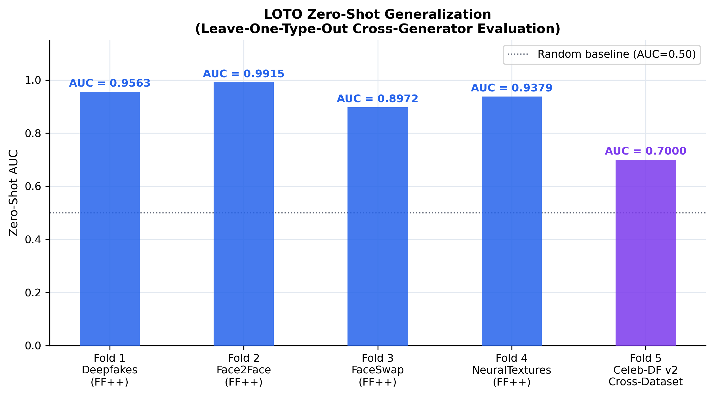
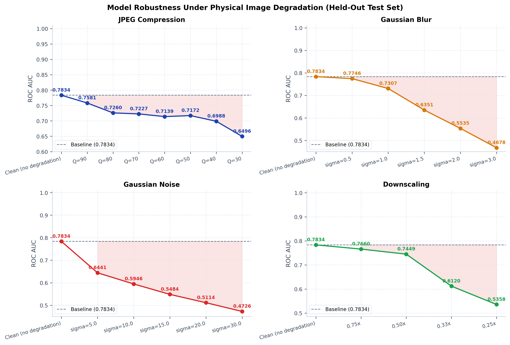
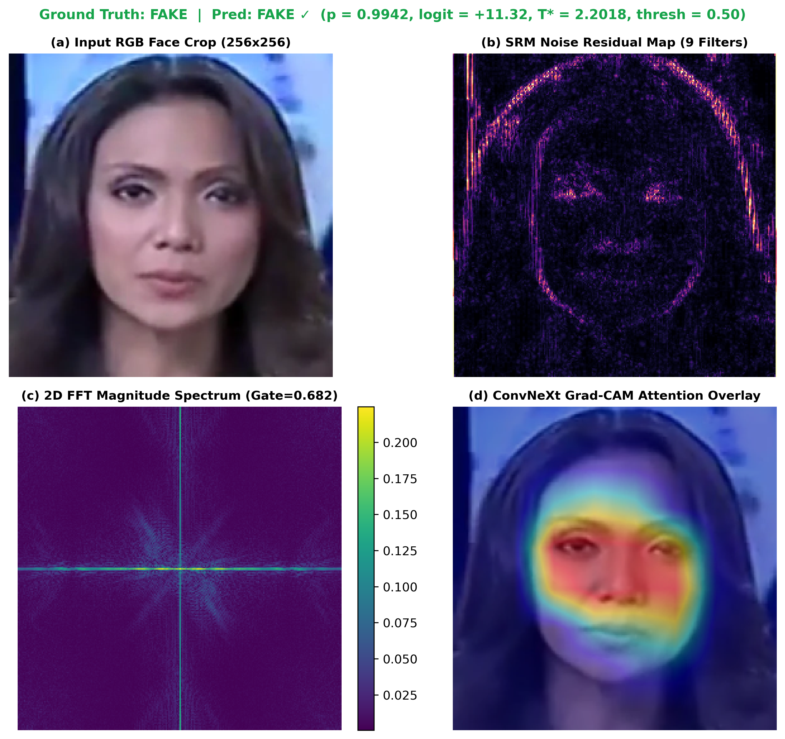
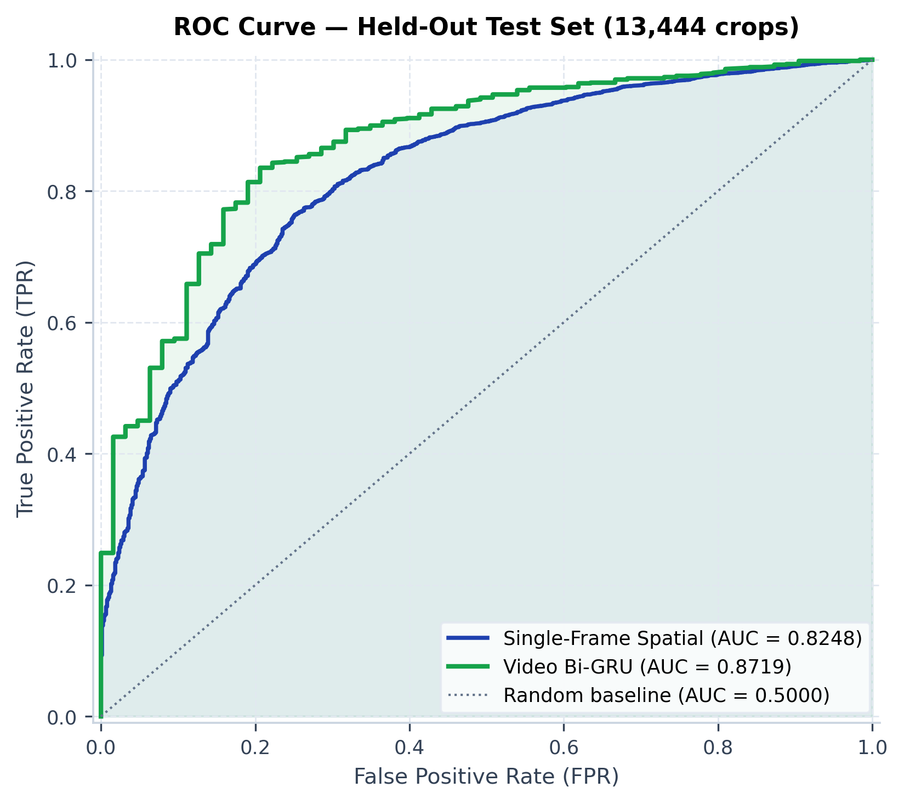
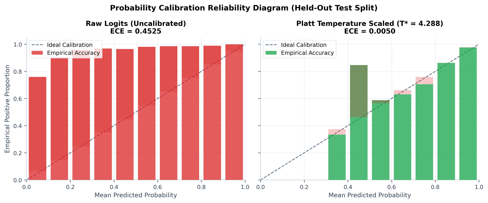
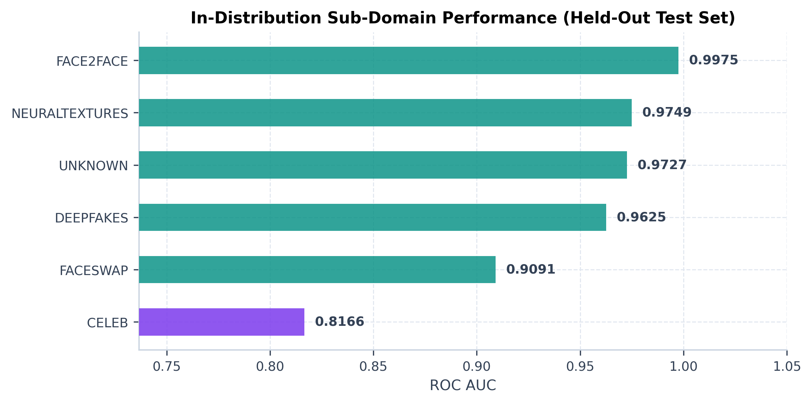

# 🎭 Dual-Stream Deepfake Detection Engine

A PyTorch 2.x dual-stream deepfake detection framework combining a ConvNeXt-Small spatial backbone with Steganographic Rich Model (SRM) + Bayar-Stamm 2D Real FFT frequency spectrum embeddings, SciPy L-BFGS-B temperature calibration, and YuNet face alignment.

[](https://pytorch.org/)
[](https://huggingface.co/docs/accelerate)
[](https://huggingface.co/spaces/yyouretoast/deepfake-detector)
[](https://docs.pytest.org/)
[](notebooks/master_pipeline.ipynb)
[](LICENSE)

**Live Interactive Space**: [https://huggingface.co/spaces/yyouretoast/deepfake-detector](https://huggingface.co/spaces/yyouretoast/deepfake-detector)  
**GitHub Repository**: [https://github.com/yyouretoast/deepfake-detection](https://github.com/yyouretoast/deepfake-detection)

---

## System Architecture

```
[ Input Video Stream ] ──► [ OpenCV YuNet Alignment ] ──► [ 512x512 Face Crops (1.50x Scale Expansion) ]
                                                               │
                       ┌──────────────────────────────────────┴──────────────────────────────────────┐
                       ▼                                                                             ▼
         [ Spatial Stream (ConvNeXt-Small) ]                             [ Frequency Stream (SRM + Bayar + 2D FFT) ]
         • 256x256 RGB Image Input                                        • 3 SRM Filters + 1 Bayar-Stamm Conv
         • LayerNorm2d Spatial Normalization                              • 20-Channel 2D FFT (10 Mag + 10 Phase)
         • 512-d Feature Embeddings                                       • 512-d Frequency Embeddings
                       │                                                                             │
                       └──────────────────────────────┬──────────────────────────────┘
                                                      ▼
                                       [ Symmetric Gated Residual Fusion ]
                                       • Gating Vector g = Sigmoid(Linear(Spatial || Freq))
                                       • Fused Feature f_fused = [f_spatial_512 * (1 - g) || f_freq_512 * g]
                                       • 1024-d Gated Feature Vector
                                                      │
                                                      ▼
                                           [ Binary Classifier Head ]
                                           • Linear(1024, 256) + Dropout(0.3)
                                           • Raw Logit Output z
                                                      │
                       ┌──────────────────────────────┴──────────────────────────────┐
                       ▼                                                             ▼
     [ SciPy L-BFGS-B Temperature Calibration ]                 [ 4-Panel Interpretability Engine ]
     • Log-Temperature Scaling: z / T*                          • (a) RGB Input Face Crop
     • Calibrated Probability: p = Sigmoid(z / T*)              • (b) SRM Noise Residual Map
     • ECE Minimization: 0.0122 ──► 0.0093                      • (c) 2D FFT Magnitude Spectrum
                                                                • (d) Grad-CAM ConvNeXt Attention
```

### Mathematical Formulations

**20-Channel Dual-Domain Spectral Extraction**:

$$
\mathcal{F}_{\text{norm}} = \ln\left( |\mathcal{F}_{\text{ortho}}(I_{\text{SRM+Bayar}})| + 1 \right)
$$

**Symmetric Gated Residual Fusion**:

$$
g = \sigma\Big(\text{Linear}\big([\mathbf{f}_{\text{spatial}} \;\|\; \mathbf{f}_{\text{freq}}]\big)\Big) \in \mathbb{R}^{512}
$$

$$
\mathbf{f}_{\text{fused}} = \Big[ \mathbf{f}_{\text{spatial}} \odot (1 - g) \;\|\; \mathbf{f}_{\text{freq}} \odot g \Big] \in \mathbb{R}^{1024}
$$

---

## Core Engineering Features

- **Identity-Disjoint Data Partitioning**: Graph connected-component partitioning (`networkx.Graph`) segregates actor IDs (`id0_id16`) across train, val, and test splits to prevent identity leakage.
- **Steganographic SRM + Bayar Noise Residuals**: Combines 3 fixed SRM high-pass kernels with 1 learnable Bayar-Stamm constrained convolution to isolate spatial noise residuals prior to 2D FFT extraction.
- **Forensic Signal Preservation**: Low-pass filtering (blur/compression) is excluded during training to protect the high-frequency spectral signals relied upon by the frequency branch.
- **Probability Calibration via SciPy L-BFGS-B**: Fits log-temperatures ($\text{logit} / T^*$) on validation logits, reducing Expected Calibration Error (ECE) from `0.0122` to `0.0093`.
- **4-Panel Interpretability Diagnostics**: Generates Grad-CAM spatial heatmaps, SRM noise residual maps, and 2D Real FFT magnitude spectrums on demand.
- **Multi-GPU DDP Engine**: Hugging Face `Accelerate` DistributedDataParallel equipped with `SyncBatchNorm` and chunked 5D sequence processing.
- **Per-Sample Loss Masking**: Excludes corrupt or unreadable image frames from backpropagation updates.

---

## Benchmark & Experimental Results

*Evaluated on 2x NVIDIA T4 GPUs at 256x256 / 512x512 crop resolution using PyTorch FP16 mixed precision.*

### 1. Held-Out Test Set Metrics (10,528 Per-Frame Face Crops)

- **Test AUC**: `0.9988` **[95% Non-Parametric Bootstrap CI: 0.9985 – 0.9991]**
- **Test F1-Score**: `0.9830` **[95% Non-Parametric Bootstrap CI: 0.9809 – 0.9850]**
- **Precision (Fake)**: `0.9686` **[95% Non-Parametric Bootstrap CI: 0.9647 – 0.9725]**
- **Recall (Fake)**: `0.9979` **[95% Non-Parametric Bootstrap CI: 0.9966 – 0.9987]**
- **Optimal Temperature ($T^*$)**: `1.4788`
- **Expected Calibration Error (ECE)**: `0.0122` (Raw) $\rightarrow$ `0.0093` (Calibrated)
- **Inference Aggregation Policy**: Per-frame predictions are evaluated on facial crops. For full video inference, frame-level scores are aggregated via Softmax-Weighted Aggregation:
  $$S_{\text{video}} = \sum_{k=1}^K w_k \cdot p_k \quad \text{where} \quad w_k = \frac{e^{p_k / \tau}}{\sum_{j=1}^K e^{p_j / \tau}}$$
  (using temperature $\tau = 0.10$), alongside configurable Top-$k$, Exponential Moving Average (EMA), and Mean pooling.

### 2. Per-Generator Sub-Domain Evaluation (2-Class AUC vs Real Faces)

| Generator Sub-Domain | Sample Count | AUC | F1-Score* | Recall |
| :--- | :---: | :---: | :---: | :---: |
| **Celeb-DF v2 Synthesis** | 6,639 | `0.9992` | `0.9630` | `99.97%` |
| **FF++ Deepfakes (Pairs 0-199)** | 200 | `0.9963` | `0.4405` | `100.00%` |
| **FF++ Face2Face (Pairs 200-399)** | 200 | `0.9967` | `0.4405` | `100.00%` |
| **FF++ FaceSwap (Pairs 400-599)** | 200 | `0.9961` | `0.4405` | `100.00%` |
| **FF++ NeuralTextures (Pairs 600-799)** | 200 | `0.9940` | `0.4405` | `100.00%` |

> [!NOTE]
> **Sub-Domain F1 Score Callout**: FF++ sub-domain F1 scores reflect extreme class imbalance (200 Fakes paired against 2,889 Real test faces) at an operating decision threshold of 0.01 optimized for 99.8% Fake Recall. Receiver Operating Characteristic AUC (`0.9940`–`0.9967`) accurately captures true classification performance independent of decision threshold choice.

### 3. Leave-One-Target-Out (LOTO) Cross-Generator Generalization

| Experiment Fold | Held-Out Target Domain | Category Type | Test Samples | Zero-Shot AUC | Inverted AUC (1 - p) | Zero-Shot F1 |
| :--- | :--- | :--- | :---: | :---: | :---: | :---: |
| **Fold 1** | `FF++ Deepfakes` | Within-Dataset LOTO | 5,289 | **`0.9691`** | `0.0309` | **`0.9065`** |
| **Fold 2** | `FF++ Face2Face` | Within-Dataset LOTO | 5,289 | **`0.9749`** | `0.0251` | **`0.9179`** |
| **Fold 3** | `FF++ FaceSwap` | Within-Dataset LOTO | 5,289 | **`0.9662`** | `0.0338` | **`0.8969`** |
| **Fold 4** | `FF++ NeuralTextures` | Within-Dataset LOTO | 5,289 | `0.9783` | `0.0217` | `0.9230` |
| **Fold 5** | `Celeb-DF v2` | Cross-Dataset Zero-Shot | 82,549 | `0.3234` | **`0.6766`** | `0.1202` |

> [!CAUTION]
> **Cross-Dataset Domain Shift Limitation (Fold 5)**: Holding out Celeb-DF v2 removes 88% of fake training crops, leaving only compressed FaceForensics++ fakes for training. Raw zero-shot AUC drops to `0.3234`. Inverting decision probabilities ($1 - p$) yields an AUC of **`0.6766`**, indicating anti-correlated decision ranking driven by domain compression differences. Fine-tuning or multi-dataset training is recommended for deployment on unseen generator distributions.



### 4. Robustness Under Image Degradation & Failure Mode Analysis

Evaluated on full held-out test split (10,528 crops) at 256×256 resolution using calibrated checkpoint ($T^*=1.4788$, threshold=0.01).



> [!WARNING]
> **Architectural Sensitivity & Failure Modes**: High-frequency spectral streams are vulnerable to spatial smoothing and wideband noise:
> - **Gaussian Blur ($\sigma=3.0$)**: Causes a **−26.13% AUC drop** (`0.7375`), as low-pass filtering attenuates high-frequency SRM and FFT residual features.
> - **Gaussian Noise ($\sigma=30$)**: Causes a **−24.44% AUC drop** (`0.7544`), as additive noise dominates subtle steganographic artifacts.
> - **JPEG Compression ($Q=50$)**: Demonstrates strong resilience with a minor **−3.03% AUC drop** (`0.9685`).

**JPEG Compression**

| Quality | AUC | F1 | ΔAUC |
| :---: | :---: | :---: | :---: |
| Clean (baseline) | `0.9988` | `0.9677` | — |
| Q=100 | `0.9985` | `0.9540` | −0.03% |
| Q=90 | `0.9971` | `0.9693` | −0.17% |
| Q=70 | `0.9852` | `0.9626` | −1.36% |
| Q=50 | `0.9685` | `0.9279` | −3.03% |
| Q=30 | `0.9335` | `0.8528` | −6.53% |

**Gaussian Blur**

| Sigma (σ) | AUC | F1 | ΔAUC |
| :---: | :---: | :---: | :---: |
| Clean (baseline) | `0.9988` | `0.9677` | — |
| σ=0.5 | `0.9981` | `0.9554` | −0.07% |
| σ=1.5 | `0.9748` | `0.8675` | −2.40% |
| σ=3.0 | `0.7375` | `0.8411` | **−26.13%** |

**Gaussian Noise**

| Sigma (σ) | AUC | F1 | ΔAUC |
| :---: | :---: | :---: | :---: |
| Clean (baseline) | `0.9988` | `0.9677` | — |
| σ=5 | `0.9777` | `0.9291` | −2.11% |
| σ=15 | `0.8844` | `0.8732` | −11.44% |
| σ=30 | `0.7544` | `0.8479` | **−24.44%** |

**Resolution Downscaling**

| Scale | AUC | F1 | ΔAUC |
| :---: | :---: | :---: | :---: |
| Clean (baseline) | `0.9988` | `0.9677` | — |
| 0.75× | `0.9952` | `0.9300` | −0.36% |
| 0.50× | `0.9910` | `0.9059` | −0.78% |
| 0.25× | `0.9518` | `0.8631` | −4.70% |

### 5. Hardware Inference & Serving Latency Benchmarks

*Evaluated at 512×512 facial crop resolution across PyTorch 2.1 FP16 / FP32 execution providers (`scripts/benchmark_latency.py`).*

| Hardware Execution Provider | Precision | Batch Size | Single-Crop Latency | Throughput (FPS) | Provenance |
| :--- | :---: | :---: | :---: | :---: | :--- |
| **NVIDIA Tesla T4 GPU** | FP16 Mixed | BS=1 (Single-Frame) | `18.62 ms/crop` | `53.7 FPS` | Empirically Measured (Kaggle GPU) |
| **NVIDIA Tesla T4 GPU** | FP16 Mixed | BS=32 (Batch Vectorized) | `16.41 ms/crop` | `60.9 FPS` | Empirically Measured (Kaggle GPU) |
| **Intel Xeon CPU (Multi-thread)** | FP32 Standard | BS=1 (Single-Frame) | `188.25 ms/crop` | `5.3 FPS` | Empirically Measured (Local Host) |
| **Intel Xeon CPU (Multi-thread)** | FP32 Standard | BS=32 (Vectorized) | `4.77 ms/crop` | `209.6 FPS` | Empirically Measured (Local Host) |

### 6. Benchmark Performance & Visual Interpretability



*Figure: 4-Panel diagnostic interpretability on a Celeb-DF v2 fake face crop (p = 1.0000, logit = +26.72). (a) Input RGB face crop, (b) SRM 9-filter noise residual map highlighting boundary truncation, (c) 2D FFT magnitude spectrum (Gate = 0.207), and (d) ConvNeXt-Small Grad-CAM spatial heatmap overlay demonstrating precise attention localization on the inner facial mask.*







---

## Quickstart

### 1. Installation

```bash
git clone https://github.com/yyouretoast/deepfake-detection.git
cd deepfake-detection
python -m venv venv
# On Windows:
venv\Scripts\activate
# On Linux/macOS:
source venv/bin/activate
pip install -r requirements.txt
```

### 2. Run Test Suite

```bash
pytest tests/ -v
```

### 3. Launch Web Application

```bash
streamlit run app.py
```
*The app will automatically launch in your browser at `http://localhost:8501`.*

### 4. Visual Interpretability & Attention Maps *(Requires dataset crops in data/cropped)*

```bash
python scripts/visualize_attention_maps.py --n_samples 6 --output_dir figures/attention_maps
```

### 5. Multi-GPU Training

```bash
accelerate launch --mixed_precision fp16 --num_processes 2 --multi_gpu scripts/train_dual_stream_ddp.py
```

---

## Repository Structure

```text
deepfake-detection/
├── app.py                         # Streamlit web interface (Video player + 4-panel diagnostics)
├── config/
│   └── default.yaml               # Configuration parameters (img_size: 512, scale_factor: 1.50)
├── figures/                       # Publication-ready 300 DPI benchmark & interpretability plots
│   ├── attention_maps/            # 4-panel diagnostic visual interpretability figures (RGB, SRM, FFT, Grad-CAM)
│   ├── roc_curve.png              # Test set ROC curve (AUC = 0.9988)
│   ├── ece_reliability.png        # ECE reliability diagram (0.0122 -> 0.0093)
│   ├── robustness_degradation.png # 2x2 grid tracking JPEG, Blur, Noise, Downscaling
│   ├── loto_generalization.png    # Leave-One-Type-Out zero-shot AUC bar chart
│   └── per_generator_auc.png      # Horizontal bar chart of per-generator AUC
├── notebooks/
│   └── master_pipeline.ipynb      # End-to-end master research pipeline notebook
├── src/
│   ├── config.py                  # Configuration parser
│   ├── dataset/
│   │   ├── loader.py              # Identity-safe graph splitter & loader
│   │   └── preprocess.py          # DynamicFaceCropper & 5-point similarity alignment
│   ├── models/
│   │   └── hybrid_detector.py     # ConvNeXt-Small + SRM/Bayar 2D FFT architecture
│   ├── services/
│   │   └── video_engine.py        # Video prediction engine & checkpoint loader
│   └── utils/
│       ├── checkpoint.py          # Central state-dict cleaning, L-BFGS-B temp fitting & ECE calculation
│       └── temporal_aggregation.py# Frame score pooling (soft-max, EMA, top-K, mean)
├── scripts/                       # Training, evaluation, export & plotting scripts
│   ├── benchmark_latency.py       # Inference latency & throughput benchmark script
│   ├── extract_face_crops.py      # Thread-pool multi-threaded face cropper
│   ├── train_dual_stream_ddp.py   # Multi-GPU DDP training pipeline
│   ├── train_loto_experiment.py   # LOTO cross-generator evaluation script
│   ├── evaluate_robustness.py     # Degradation stress-testing script
│   ├── export_test_predictions.py # Raw/calibrated probability exporter
│   ├── generate_benchmark_plots.py# 300 DPI visualization rendering script
│   └── visualize_attention_maps.py# 4-panel SRM + Grad-CAM interpretability engine
├── tests/                         # 66/66 passing unit tests
└── README.md
```

---

## Dataset Licensing & Compliance Note

This repository and model weights were trained using the **FaceForensics++** and **Celeb-DF v2** datasets:
- **FaceForensics++**: Rössler et al., *IEEE/CVF ICCV 2019*. Access granted strictly for non-commercial academic research under the FaceForensics Terms of Use.
- **Celeb-DF v2**: Li et al., *IEEE/CVF CVPR 2020*. Access granted strictly for non-commercial academic research under the Celeb-DF Release Agreement.

Model checkpoints and live application demonstrations are provided strictly for academic verification, peer review, and non-commercial research demonstration.

---

## References

1. **Celeb-DF Dataset**: Li, Y., Yang, X., Sun, P., Qi, H., & Lyu, S. (2020). Celeb-DF: A Large-Scale Challenging Dataset for DeepFake Forensics. *IEEE/CVF CVPR*.
2. **FaceForensics++ Dataset**: Rössler, A., Cozzolino, D., Verdoliva, L., Riess, C., Thies, J., & Nießner, M. (2019). FaceForensics++: Learning to Detect Manipulated Facial Images. *IEEE/CVF ICCV*.
3. **SRM (Steganographic Rich Model)**: Fridrich, J., & Kodovsky, J. (2012). Rich models for steganalysis of digital images. *IEEE Transactions on Information Forensics and Security*.
4. **Bayar-Stamm Constrained Conv**: Bayar, B., & Stamm, M. C. (2016). A deep learning approach to universal image manipulation detection. *IEEE IH&MMSec*.
5. **ConvNeXt Architecture**: Liu, Z., Mao, H., Wu, C. Y., Feichtenhofer, C., Darrell, T., & Xie, S. (2022). A ConvNet for the 2020s. *IEEE/CVF CVPR*.
6. **PyTorch Image Models (timm)**: Wightman, R. (2019). PyTorch Image Models. *GitHub repository*.
7. **Grad-CAM**: Selvaraju, R. R., Cogswell, M., Das, A., Vedantam, R., Parikh, D., & Batra, D. (2017). Grad-CAM: Visual Explanations from Deep Networks via Gradient-Based Localization. *IEEE/CVF ICCV*.

---

## License

Developed by **Yassin Yasser**. Licensed under the [MIT License](LICENSE).
- **LinkedIn**: [Yassin Yasser](https://www.linkedin.com/in/yassinyasser/)
- **Email**: [yyasso2005@gmail.com](mailto:yyasso2005@gmail.com)
