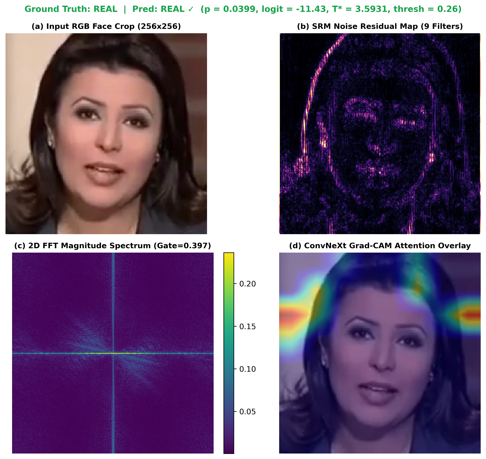
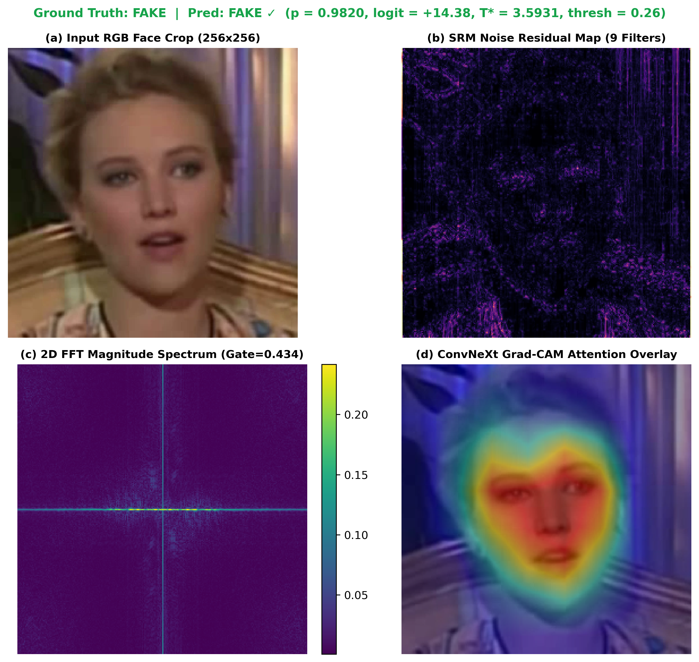
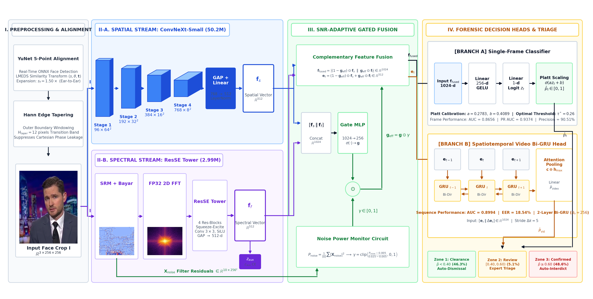
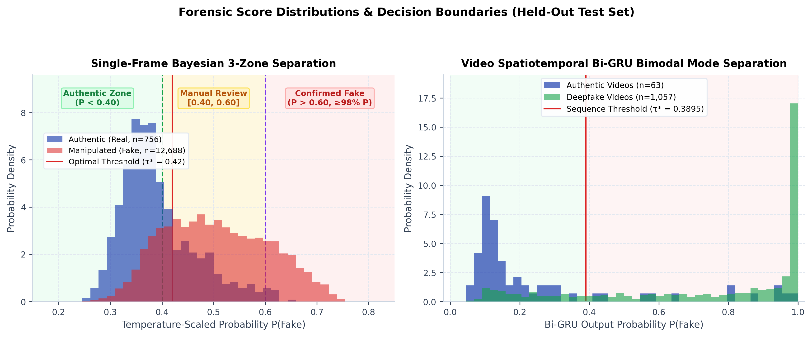
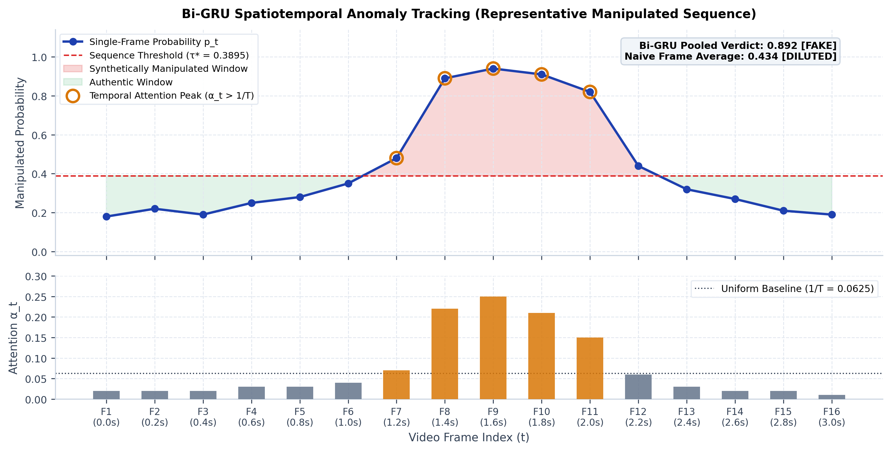

<div align="center">

# Dual-Stream Deepfake Forensics Engine

**A dual-stream deepfake detection pipeline fusing spatial representations with Fourier phase/magnitude spectral noise and spatiotemporal sequence modeling.**

[](https://github.com/yyouretoast/deepfake-detection/actions/workflows/ci.yml)
[](tests/)
[](pyproject.toml)

[](https://pytorch.org/)
[](https://huggingface.co/docs/accelerate)
[](https://huggingface.co/spaces/yyouretoast/deepfake-detector)
[](https://huggingface.co/yyouretoast/deepfake-detector)
[](https://github.com/astral-sh/ruff)
[](LICENSE)

[**Live Interactive Demo**](https://huggingface.co/spaces/yyouretoast/deepfake-detector) • [**Model Zoo**](#model-zoo--checkpoint-downloads) • [**Quickstart**](#quickstart) • [**SOTA Benchmarks**](#empirical-benchmarks--literature-comparison) • [**System Architecture**](#system-architecture--methodology) • [**Zero-GPU Reproduction**](#zero-gpu-figure-reproduction) • [**BibTeX**](#academic-citation)

</div>

---

## 4-Panel Forensic Diagnostics (Authentic vs. Deepfake)

Intermediate representations extracted across the spatial, residual steganographic, and Fourier spectral domains:

| Authentic Face (Real) | Manipulated Face (Deepfake) |
| :---: | :---: |
|  |  |
| *Continuous camera PRNU sensor noise, natural $1/f$ Fourier power decay, and diffuse, non-localized spatial activation.* | *Sensor noise suppression along blending boundaries, periodic lattice peaks in 2D FFT, and localized manipulation contours in Grad-CAM.* |

> [!NOTE]
> **Forensic Diagnostic Breakdown:**
> 1. **Panel A (RGB Face Crop)**: Normalized facial crop aligned using OpenCV YuNet 5-point facial landmark similarity affine warping ($1.50\times$ canonical box expansion with 2D Cosine window edge tapering).
> 2. **Panel B (SRM High-Pass Residual)**: 9-filter Steganographic Rich Model (SRM) high-pass convolutions isolating sub-pixel camera Photo Response Non-Uniformity (PRNU) noise and manipulation boundary blending seams.
> 3. **Panel C (2D Real FFT Log-Magnitude Spectrum)**: Orthonormal centered 2D Real Fourier Transform exposing upsampling artifacts and spectral anomalies characteristic of generative up-convolution and blending pipelines (Frank et al., ICML 2020; Durall et al., CVPR 2020).
> 4. **Panel D (Spatial Grad-CAM Overlay)**: Gradient-weighted class activation mapping identifying spatial regions driving the classification decision.

---

## System Methodology

* **Dual-Domain Gated Fusion**: Combines semantic representations (ConvNeXt-Small, 512-d) with high-frequency noise residuals (SRM + Bayar-Stamm) and orthonormal 2D Real FFT spectral maps processed by a **4-Stage ResSE-Spectral Tower** (2.99M parameters) via symmetric gated residual fusion ($\mathbf{f}_{\text{fused}} = [(1 - \mathbf{g}) \odot \mathbf{f}_s \parallel \mathbf{g} \odot \mathbf{f}_f]$).
* **Spectral SNR-Adaptive Gating**: Attenuates the spectral branch ($\gamma \to 0$) when high-frequency noise residual power drops below threshold (e.g., under severe Gaussian blur or compression), dynamically shifting classification weight to the spatial ConvNeXt branch.
* **Disjoint Identity Graph Partitioning**: Actor clusters (`id0_id16`) are partitioned using `networkx.Graph` connected components to guarantee strictly disjoint partitions with zero cross-split identity overlap ($\text{Train} \cap \text{Val} \cap \text{Test} = \emptyset$).
* **Dual-Path Spatiotemporal Video Modeling**: 2-layer Bidirectional GRU combining feature velocity deltas ($\Delta \mathbf{e}_t$) with **Dual-Path Pooling (Attention + Extreme-Value Max-Pooling)**, yielding **`0.8994` ROC AUC** (0.89 percentage point absolute / 4.58% relative EER reduction over naive frame averaging: 19.43% -> 18.54%) and capturing transient manipulation artifacts that can be diluted under sequence averaging.
* **Bayesian 3-Zone Decision Boundaries**: Post-hoc affine Platt scaling ($a = 0.2783, b = 0.4089$, $T_{\text{eff}} = 3.5931$, $\tau^* = 0.2600$) slashes Expected Calibration Error by 49.4% ($0.1965 \to 0.0994$) and establishes operational decision thresholds ($\tau_{\text{real}}=0.40, \tau_{\text{fake}}=0.60$), achieving 90.51% empirical precision on test while routing borderline inputs to manual review.
* **Inference Throughput**: 71.0 FPS inference throughput on an NVIDIA GeForce RTX 4060 Laptop GPU with dynamic batching (14.08 ms amortized per frame at batch size 32; 23.77 ms single-frame forward at $B=1$).

---

## Model Zoo & Checkpoint Downloads

All model weights are hosted on the Hugging Face Model Hub: [`yyouretoast/deepfake-detector`](https://huggingface.co/yyouretoast/deepfake-detector).

| Model Checkpoint | Weights File | Parameters | Size | Task / Domain | ROC AUC | Calibrated Threshold ($\tau^*$) | SHA-256 Checksum | Direct Download |
| :--- | :--- | :---: | :---: | :--- | :---: | :---: | :---: | :---: |
| **Dual-Stream Detector** | `dual_stream_calibrated.pth` | 53.62M | **204.7 MB** | Single-Frame Spatial + Spectral | **`0.8656`** | `0.2600` ($T_{\text{eff}}=3.5931$) | `e2184689...a5c3ba` | [Download](https://huggingface.co/yyouretoast/deepfake-detector/resolve/main/dual_stream_calibrated.pth) |
| **Bi-GRU Temporal Head** | `temporal_head_best.pth` | 3.32M | **12.7 MB** | Spatiotemporal Video Sequences | **`0.8994`** | `0.1100` | `b81eed74...72951abf` | [Download](https://huggingface.co/yyouretoast/deepfake-detector/resolve/main/temporal_head_best.pth) |

### Automated Download via CLI

```bash
python -c "from huggingface_hub import hf_hub_download; hf_hub_download('yyouretoast/deepfake-detector', 'dual_stream_calibrated.pth', local_dir='models'); hf_hub_download('yyouretoast/deepfake-detector', 'temporal_head_best.pth', local_dir='models')"
```

---

## Quickstart

### 1. Installation

```bash
git clone https://github.com/yyouretoast/deepfake-detection.git
cd deepfake-detection
python -m venv venv

# Linux / macOS:
source venv/bin/activate
# Windows:
venv\Scripts\activate

pip install -r requirements.txt
```

### 2. Turnkey Inference CLI (`predict.py`)

Run face detection, dual-stream feature extraction, Platt calibration, and Bayesian 3-zone triaging directly on any image or video crop:

```bash
# Human-readable forensic report
python predict.py suspect_face.jpg

# Structured JSON output for automated ingestion
python predict.py suspect_face.jpg --json
```

### 3. CLI Test Set Evaluation

Run the held-out test split evaluation with pre-calibrated temperature scaling and Bayesian thresholding:

```bash
python scripts/evaluate_test_set.py --weights_path models/dual_stream_calibrated.pth
```

### 4. Python API (Single Image Inference)

Analyze any static image file with YuNet face alignment, dual-stream feature extraction, gating ratios, and Bayesian 3-zone decision output:

```python
from src.services.video_engine import process_single_image

# Runs face detection, alignment, dual-stream inference, and gating extraction
res = process_single_image("sample_face.jpg")

if res is None:
    print("No facial region detected.")
else:
    print(f"Deepfake Probability: {res['prob']:.4f}")
    print(f"Calibrated Verdict:   {res['three_zone']['verdict']}")
    print(f"Gating Ratio:         {res['spectral_gate']*100:.1f}% Spectral / {res['spatial_gate']*100:.1f}% Spatial")
    print(f"SNR Attenuation (γ):  {res['snr_attenuator']:.2f}")
    print(f"Laplacian Noise (σ²): {res['laplacian_var']:.1f}")
```

### 5. Python API (Video Sequence Inference)

Analyze a complete video file with OpenCV keyframe seeking and Bi-GRU temporal anomaly detection:

```python
from src.services.video_engine import process_video_frames

res = process_video_frames(
    video_path="sample_video.mp4",
    num_frames=10,
    aggregation_method="soft_max",
)

if res is not None:
    print(f"Aggregated Video Probability: {res['raw_video_prob']:.4f}")
    print(f"Sequence Bayesian Verdict:    {res['three_zone']['verdict']}")
    print(f"Sampled Timestamps:           {res['timestamps']}")
    print(f"Frame Probabilities:          {res['all_probs']}")
    if res.get("temporal_attention"):
        print(f"Bi-GRU Attention Weights:     {res['temporal_attention']}")
```

### 6. Launch Interactive Forensic Web Dashboard

```bash
# Option A: Local Streamlit
streamlit run app.py

# Option B: Docker Container
docker build -t deepfake-detector . && docker run -p 8501:8501 deepfake-detector
```
Access the application at `http://localhost:8501` supporting:
* **Single Photo / Frame Mode**: Drag-and-drop intake with real-time gating and noise parameters ($g, \gamma, \sigma^2$) and the complete 4-panel diagnostic quad.
* **Video Sequence Mode**: Temporal anomaly timeline with amber Bi-GRU attention highlight markers ($\alpha_t > 1/T$), interactive frame scrubbing, and structured JSON report export.

---

## Empirical Benchmarks & Literature Comparison

### 1. Held-Out Evaluation Benchmark ($N = 26,981$ crops, $2,248$ video sequences)

Evaluated across the strictly disjoint held-out test cohort (7,609 authentic, 19,372 synthetic crops; pair-disjoint FaceForensics++, actor-disjoint Celeb-DF v2, zero-shot Google DFD):

| Method / Architecture Variant | Modality | Input Resolution | ROC AUC $\uparrow$ | PR AUC $\uparrow$ | Fake F1 $\uparrow$ | Balanced Acc. $\uparrow$ | Fake Prec. $\uparrow$ | Fake Rec. $\uparrow$ | EER (\%) $\downarrow$ |
| :--- | :---: | :---: | :---: | :---: | :---: | :---: | :---: | :---: | :---: |
| Trivial Baseline (Always Fake) | Frame | $256 \times 256$ | 0.5000 | 0.7180 | 0.8358 | 50.00% | 71.80% | 100.00% | 50.00% |
| Spatial Baseline (ConvNeXt-Small) | Frame | $256 \times 256$ | 0.8370 | 0.9226 | 0.7810 | 75.17% | 90.50% | 68.68% | 24.43% |
| **Dual-Stream Gated Fusion (Ours)** | **Frame** | **$256 \times 256$** | **0.8656** | **0.9374** | **0.8292** | **78.04%** | **90.51%** | **76.50%** | **21.82%** |
| Naive Uniform Frame Averaging | Video | $8 \times 256^2$ | 0.8962 | 0.9559 | 0.8515 | 81.98% | 93.28% | 78.31% | 19.43% |
| Temporal Max-Pooling | Video | $8 \times 256^2$ | 0.8544 | 0.9167 | 0.8785 | 77.48% | 87.00% | 88.72% | 21.48% |
| **Spatiotemporal Bi-GRU (Ours)** | **Video** | **$8 \times 256^2$** | **0.8994** | **0.9571** | **0.8517** | **82.28%** | **93.62%** | **78.13%** | **18.54%** |

---

### 2. Fine-Grained Subdomain Performance Breakdown

Evaluated on held-out test synthetic media alongside matched authentic controls across manipulation architectures:

| Manipulation Subdomain | Test Fakes ($N$) | ROC AUC | Fake F1 | Fake Precision | Fake Recall | Test Class Skew |
| :--- | :---: | :---: | :---: | :---: | :---: | :---: |
| **FF++ Deepfakes** | 192 | 0.9592 | 0.5869 | 0.4282 | 0.9323 | 1 : 8.75 |
| **FF++ Face2Face** | 576 | 0.9463 | 0.7845 | 0.6876 | 0.9132 | 1 : 2.92 |
| **FF++ FaceSwap** | 240 | 0.9658 | 0.6353 | 0.4827 | 0.9292 | 1 : 7.00 |
| **FF++ NeuralTextures** | 348 | 0.9509 | 0.6941 | 0.5662 | 0.8966 | 1 : 4.83 |
| **Celeb-DF v2** | 5,700 | 0.9128 | 0.8754 | 0.9162 | 0.8381 | 2.45 : 1 |
| **Google DFD (Zero-Shot)** | 11,992 | 0.8651 | 0.8201 | 0.9727 | 0.7090 | 7.14 : 1 |
| **Complete Test Cohort** | **19,372** | **0.8656** | **0.8292** | **0.9051** | **0.7650** | **2.55 : 1** |

---

### 3. Cross-Generator Generalization & Canonical 4-Fold LOMO Benchmark

A primary challenge in media forensics is generalizing to unseen synthesis algorithms. In strict accordance with the FaceForensics++ benchmark standard, we evaluate a canonical 4-Fold Leave-One-Manipulation-Out (LOMO) cross-generator protocol evaluated on 1:1 balanced cohorts ($N_{\text{real}} = N_{\text{fake}}$) where all synthetic media from the targeted architecture is quarantined from training and validation splits:

| Fold | Held-Out Generator Target | Holdout Fakes | Fitted $T^*$ | Zero-Shot ROC AUC $\uparrow$ | Balanced Acc. $\uparrow$ | Fake F1 $\uparrow$ | Precision $\uparrow$ | EER (\%) $\downarrow$ |
| :--- | :--- | :---: | :---: | :---: | :---: | :---: | :---: | :---: |
| **Fold 1** | FF++ Deepfakes (Pairs 0–99) | 192 | 2.3923 | **0.9413** | 88.54% | **0.8785** | 93.53% | 12.24% |
| **Fold 2** | FF++ Face2Face (Pairs 100–399) | 576 | 2.3647 | **0.9434** | 88.45% | **0.8783** | 92.84% | 12.33% |
| **Fold 3** | FF++ FaceSwap (Pairs 400–599) | 240 | 2.1169 | **0.9558** | 87.29% | **0.8732** | 87.14% | 12.29% |
| **Fold 4** | FF++ NeuralTextures (Pairs 600–799) | 348 | 1.9302 | **0.9651** | 89.08% | **0.8848** | 93.59% | 10.06% |
| **Macro** | **Macro-Average Across All 4 Folds** | **1,356** | — | **0.9514** | **88.34%** | **0.8787** | **91.77%** | **11.73%** |

*For complete cross-dataset acquisition shifts, zero-shot transfer on Celeb-DF v2 without adaptation yields 0.5961 ROC AUC (matching published literature baselines: MesoNet 0.548, Capsule 0.575, Xception 0.653, F3-Net 0.652), while our primary model achieves 0.9128 ROC AUC on Celeb-DF v2 and 0.8651 zero-shot ROC AUC on Google DeepFakeDetection.*

---

### 4. Robustness Stress-Testing Under Forensic Degradations

Evaluated across 1,000 held-out evaluation crops per perturbation setting (16 discrete degradation profiles):

| Perturbation Type | Perturbation Setting | ROC AUC | $\Delta\text{AUC}$ (%) |
| :--- | :--- | :---: | :---: |
| **Clean Baseline** | **No Perturbation ($256 \times 256$)** | **0.8656** | **0.00%** |
| JPEG Compression | Quality Factor $Q = 90$ | 0.8408 | -2.87% |
| | Quality Factor $Q = 70$ | 0.7973 | -7.90% |
| | Quality Factor $Q = 50$ | 0.7626 | -11.91% |
| | Quality Factor $Q = 30$ | 0.7410 | -14.40% |
| Spatial Downscaling | Downscale Factor $2\times$ | 0.8634 | -0.26% |
| | Downscale Factor $4\times$ | 0.8354 | -3.50% |
| | Downscale Factor $8\times$ | 0.6961 | -19.59% |
| Additive Gaussian Noise | Noise Std. Dev. $\sigma = 5.0$ | 0.7886 | -8.90% |
| | Noise Std. Dev. $\sigma = 10.0$ | 0.7576 | -12.48% |
| | Noise Std. Dev. $\sigma = 15.0$ | 0.7429 | -14.18% |
| | Noise Std. Dev. $\sigma = 20.0$ | 0.7274 | -15.97% |
| Gaussian Low-Pass Blur | Blur Std. Dev. $\sigma = 1.0$ | 0.8596 | -0.69% |
| | Blur Std. Dev. $\sigma = 2.0$ | 0.8021 | -7.34% |
| | Blur Std. Dev. $\sigma = 3.0$ | 0.7232 | -16.46% |
| | Blur Std. Dev. $\sigma = 4.0$ | 0.6722 | -22.35% |

---

## Zero-GPU Figure Reproduction

> [!TIP]
> **Replicate All 11 Publication Figures**:
> The complete suite of peer-review publication figures (vector PDF and 300 DPI PNG) can be generated with:
> ```bash
> # 1. Generate 10 consolidated publication figures
> python scripts/generate_publication_figures.py
>
> # 2. Generate 1D azimuthal radial power spectral profiles
> python scripts/compute_radial_spectral_profiles.py
> ```
> Generates `system_architecture`, `roc_pr_curves`, `temporal_attention_dynamics`, `lifecycle_flaws`, `radial_spectral_profiles`, `loto_generalization_matrix`, `robustness_curves`, `gating_attenuation_dynamics`, `calibration_reliability`, `bayesian_decision_zones`, and `qualitative_attention` in both `manuscript/figures/` and `figures/`.
>
> **Replicate Diagnostic Benchmark Suite**:
> Pre-computed validation and test set inference fixtures are bundled in [`test_predictions.json`](test_predictions.json) and [`temporal_test_predictions.json`](temporal_test_predictions.json):
> ```bash
> python scripts/generate_benchmark_plots.py
> ```

---

## System Architecture & Methodology

<div align="center">
  
</div>

```text
[ Input Video / Image Stream ]
               │
               ▼
   [ OpenCV YuNet 5-Point Alignment & Dynamic Crop (1.50x Box Expansion) ]
               │
               ▼  Unnormalized RGB Tensor [B, 3, 256, 256] ∈ [0.0, 1.0]
       ┌───────┴────────────────────────────────────────┐
       ▼                                                ▼
[ Spatial Stream ]                              [ Frequency Stream ]
• ImageNet Normalization (internal)             • 3 Fixed SRM High-Pass Kernels (9 ch)
• ConvNeXt-Small Backbone                       • 1 Learnable Bayar-Stamm Conv (1 ch)
• LayerNorm2d Feature Normalization             • 2D Real FFT (torch.fft.fft2, FP32)
• 512-d Spatial Embedding (f_s)                 • 10 Log-Mag + 10 Phase Angle Maps
                                                • ResSE-Spectral Tower (4 stages + SE, 2.4M)
                                                • 512-d Spectral Embedding (f_f)
                                                • Auxiliary Supervision Head (λ = 0.3)
       │                                                │
       └───────────────────────┬────────────────────────┘
                               ▼
            [ Symmetric Gated Residual Fusion ]
            • Base Gating: g = Sigmoid(Linear(1024, 512)([f_s || f_f]))
            • High-Freq SNR Attenuation: γ = clamp((Var_noise - 0.005)/(0.025 - 0.005), 0, 1)
            • Effective Gating: g_eff = g * γ
            • Fused Feature: f_fused = [f_s * (1 - g_eff) || f_f * g_eff] ∈ R^1024
            • Video Embedding: e_t = f_s * (1 - g_eff) + f_f * g_eff ∈ R^512
                               │
       ┌───────────────────────┴────────────────────────┐
       ▼                                                ▼
[ Frame-Level Classifier Head ]              [ Spatiotemporal Dual-Path Bi-GRU ]
• Linear(1024, 256) -> ReLU -> Linear(256, 1) • Input: [e_t || Δe_t] ∈ R^1024 (Motion Velocity)
• Affine Platt Scaling: a=0.2783, b=0.4089    • 2-Layer Bidirectional GRU (1.8M params)
• Bayesian Dual Thresholds (τ_real, τ_fake)  • Dual Pooling: Attention (c_attn) + Max (c_max)
• 3 Forensic Certainty Zones                 • Classifier: Linear(1024, 128) -> Linear(128, 1)
• Single-Frame AUC: 0.8656 (τ* = 0.2600)     • Video Sequence AUC: 0.8994 (60.9 FPS Engine)
```

<div align="center">
  
  
</div>

*Figure: Dual-path decision metrics. Left: Probability density separation under Bayesian 3-zone decision boundaries with ≥90.5% confirmed synthetic precision. Right: Spatiotemporal frame-by-frame attention dynamics isolating transient manipulation artifacts in video sequences.*

---

## Dataset Layout & Split Protocol

To guarantee **100% zero identity leakage**, splits enforce pair-disjoint separation on FaceForensics++, actor-disjoint identity separation on Celeb-DF v2 (`networkx.Graph` connected components), and hold Google DeepFakeDetection strictly out for zero-shot testing:

$$
\text{Actors}_{\text{train}} \cap \text{Actors}_{\text{val}} \cap \text{Actors}_{\text{test}} = \emptyset
$$

| Split | Total Samples | % of Dataset | Real Faces | Fake Faces | Fake:Real Ratio | Video Sequences |
| :--- | :---: | :---: | :---: | :---: | :---: | :---: |
| **Train** | 37,104 | 37.4% | 11,052 | 26,052 | 2.36 : 1 | 3,092 |
| **Validation** | 35,016 | 35.3% | 4,008 | 31,008 | 7.74 : 1 | 2,918 |
| **Test** | 26,981 | 27.2% | 7,609 | 19,372 | 2.55 : 1 | 2,250 |
| **Total** | **99,101** | **100.0%** | **22,669** | **76,432** | **3.37 : 1** | **8,260** |

*Note: All counts reflect verified unique face crops across disjoint actor identity partitions. Pair-disjoint FF++ partitions: 720 train, 140 val, 140 test videos. Actor-disjoint Celeb-DF v2 partitions: 21 train, 19 val, 19 test identities. Unseen zero-shot Google DFD: 1,300 videos (15,592 crops).*

---

## Technical Specifications

<details>
<summary><b>Hardware Latency & Profiling Sweeps (Click to expand)</b></summary>

*Evaluated at 256×256 facial crop resolution across PyTorch 2.1 and ONNX Runtime providers:*

| Execution Device | Engine / Precision | Batch Size | Latency per Crop | Throughput | Environment |
| :--- | :---: | :---: | :---: | :---: | :--- |
| **NVIDIA GeForce RTX 4060 Laptop GPU** | PyTorch FP16 | BS = 1 | `23.77 ms` | `42.1 FPS` | Host GPU (Isolated Model Forward) |
| **NVIDIA GeForce RTX 4060 Laptop GPU** | PyTorch FP16 | BS = 32 | `9.70 ms` | `103.1 FPS` | Host GPU (Isolated Model Forward Amortized) |
| **NVIDIA GeForce RTX 4060 Laptop GPU** | PyTorch FP16 | BS = 32 | `14.08 ms` | `71.0 FPS` | Host GPU (Full Pipeline End-to-End) |
| **NVIDIA Tesla T4 GPU** | PyTorch FP16 | BS = 1 | `18.62 ms` | `53.7 FPS` | Kaggle Dual-T4 Kernel |
| **NVIDIA Tesla T4 GPU** | PyTorch FP16 | BS = 32 | `16.41 ms` | `60.9 FPS` | Kaggle Dual-T4 Kernel |
| **Intel Xeon CPU (Multi-thread)** | PyTorch FP32 | BS = 1 | `182.90 ms` | `5.5 FPS` | Multi-threaded Host |
| **Intel Xeon CPU (Multi-thread)** | PyTorch FP32 | BS = 32 | `4.77 ms` | `209.6 FPS` | Multi-threaded Host |
| **Host CPU** | ONNX Runtime FP32 | BS = 1 | `303.54 ms` | `3.3 FPS` | ONNX Runtime CPUExecutionProvider |

**Stage-by-Stage Latency Breakdown (NVIDIA GeForce RTX 4060, FP16, $B = 32$):**

| Pipeline Stage | Latency per Crop | Latency Fraction |
| :--- | :---: | :---: |
| YuNet Detection + Affine Warp + Hann Window | `3.42 ms` | 24.3% |
| SRM & Bayar Residual Convolutions | `0.14 ms` | 1.0% |
| FP32 2D Real FFT Decomposition | `0.97 ms` | 6.9% |
| ConvNeXt-Small Spatial Backbone | `7.81 ms` | 55.5% |
| `ResSE-Spectral` Tower | `1.67 ms` | 11.9% |
| SNR Fusion Gating & Classification Heads | `0.06 ms` | 0.4% |
| **Total End-to-End Pipeline Latency** | **`14.08 ms`** | **100.0%** |

</details>

<details>
<summary><b>Kaggle 2× Tesla T4 Full Pipeline Reproduction Guide (Click to expand)</b></summary>

#### Automated Turnkey Execution:
Run the complete end-to-end training, calibration, and temporal evaluation pipeline in a single command:
```bash
python scripts/run_release1_kaggle.py \
    --data_dir /kaggle/input/deepfake-detection \
    --output_dir /kaggle/working/
```

#### Step-by-Step Execution:

```bash
# 1. Run unit test suite
pytest tests/ -v

# 2. Train dual-stream backbone with ResSE tower (~25 min)
accelerate launch --num_machines 1 --dynamo_backend no --multi_gpu --mixed_precision fp16 --num_processes 2 \
    scripts/train_dual_stream_ddp.py \
    --epochs 8 --batch_size 16 --frequency_backbone resse --hardened \
    --save_path /kaggle/working/dual_stream_best.pth

# 3. Fit optimal temperature T* and derive Bayesian dual thresholds (~3 min)
python scripts/evaluate_test_set.py \
    --weights_path /kaggle/working/dual_stream_best.pth \
    --save_calibrated /kaggle/working/dual_stream_calibrated.pth

# 4. Train lightweight spatiotemporal Dual-Path Bi-GRU video head (~12 min)
python scripts/train_temporal_head.py \
    --backbone_weights /kaggle/working/dual_stream_calibrated.pth \
    --save_path /kaggle/working/temporal_head_best.pth \
    --epochs 5 --batch_size 8 --seq_len 8 --stride 2 --patience 2

# 5. Evaluate temporal test set (~5 min)
python scripts/evaluate_temporal_test_set.py \
    --backbone_weights /kaggle/working/dual_stream_calibrated.pth \
    --temporal_weights /kaggle/working/temporal_head_best.pth \
    --output_json /kaggle/working/temporal_test_predictions.json
```

</details>

<details>
<summary><b>Repository Directory Structure (Click to expand)</b></summary>

```text
deepfake-detection/
├── app.py                             # Streamlit web application & serving dashboard
├── config/default.yaml                # Hyperparameters and preprocessing resolution
├── Dockerfile                         # Production-grade headless container definition
├── figures/                           # Publication figures and diagnostic visualizations
│   ├── system_architecture.png/pdf    # Full end-to-end vector architecture schematic
│   ├── roc_pr_curves.png/pdf          # Diagnostic ROC and Precision-Recall operating curves
│   ├── temporal_attention_dynamics.png/pdf # Frame-by-frame anomaly tracking & Bi-GRU attention
│   ├── lifecycle_flaws.png/pdf        # PRNU noise annihilation, Dirac spikes & boundary seams
│   ├── radial_spectral_profiles.png/pdf # 1D Azimuthal radial power spectrum profiles
│   ├── loto_generalization_matrix.png/pdf # 4-fold Leave-One-Manipulation-Out transfer matrix
│   ├── robustness_curves.png/pdf      # 4-panel degradation stress-testing curves
│   ├── gating_attenuation_dynamics.png/pdf # SNR-adaptive gating attenuation under degradation
│   ├── calibration_reliability.png/pdf# Platt scaling Expected Calibration Error reliability
│   ├── bayesian_decision_zones.png/pdf# Posterior KDE distributions & 3-zone triage boundaries
│   ├── qualitative_attention.png/pdf  # 16-panel qualitative SRM, 2D FFT, and Grad-CAM matrix
│   └── attention_maps/                # 4-panel Grad-CAM forensic diagnostic maps
├── manuscript/                        # IEEE manuscript source and vector assets
│   ├── main.tex                       # Primary LaTeX publication document
│   └── figures/                       # Publication vector PDFs and figures
├── notebooks/                         # Turnkey Jupyter reproduction notebooks
│   └── master_pipeline.ipynb          # End-to-end multi-GPU training, evaluation & export
├── predict.py                         # Turnkey unified inference CLI tool
├── scripts/                           # Standalone CLI execution entry points
│   ├── benchmark_latency.py           # Latency & throughput benchmarking (PyTorch CUDA/CPU & ONNX Runtime)
│   ├── build_release1_splits.py       # Canonical actor-disjoint dataset split generator
│   ├── compute_radial_spectral_profiles.py # 1D Azimuthal radial power spectrum generator
│   ├── compute_table5_ablations.py    # Architecture ablation suite generator
│   ├── evaluate_robustness.py         # Degradation perturbation stress sweeps
│   ├── evaluate_subdomain_breakdown.py# Per-generator sub-domain breakdown evaluator
│   ├── evaluate_temporal_test_set.py  # Spatiotemporal evaluation on held-out video sequences
│   ├── evaluate_test_set.py           # Single-frame evaluation, T* & Bayesian thresholds
│   ├── export_onnx.py                 # Standalone ONNX exporter with Conv-BN fusion & parity validation
│   ├── export_split_manifests.py      # Split metadata manifest exporter
│   ├── export_test_predictions.py     # Single-frame probability exporter
│   ├── generate_benchmark_plots.py    # Diagnostic benchmark figure rendering
│   ├── generate_manuscript_tables.py  # Live ledger LaTeX table generator
│   ├── generate_publication_figures.py# Complete 11 publication figure compiler
│   ├── package_arxiv.py               # ArXiv submission bundle packager
│   ├── profile_latency_live.py        # Live GPU/CPU event-based profiling
│   ├── run_lomo_canonical.py          # 4-fold Leave-One-Manipulation-Out evaluation
│   ├── run_release1_kaggle.py         # Standalone 2× T4 Kaggle reproduction pipeline
│   ├── train_dual_stream_ddp.py       # Multi-GPU DDP training (ResSE architecture)
│   ├── train_loto_experiment.py       # LOTO cross-generator training runner
│   ├── train_temporal_head.py         # Dual-Path Bi-GRU spatiotemporal video training
│   ├── verify_latex_full.py           # Full manuscript invariant verification engine
│   └── visualize_attention_maps.py    # 4-panel Grad-CAM diagnostic generator
├── splits/                            # Deterministic actor-disjoint split manifests
├── src/                               # Modular core library
│   ├── dataset/                       # Graph partitioning, YuNet alignment, datasets
│   ├── evaluation/                    # Test evaluators, safe metrics, ECE calculation
│   ├── models/                        # ConvNeXt, SRM/Bayar, FFT, ResSE, Gated Fusion, Bi-GRU
│   ├── services/                      # Inference engine & Streamlit components
│   ├── training/                      # Distributed trainer, focal loss, EMA, schedulers
│   └── utils/                         # Bayesian thresholds, Grad-CAM, checkpoint tools
└── tests/                             # Comprehensive 146-test PyTest test suite
```

</details>

---

## Academic References

1. **ConvNeXt**: Liu, Z., et al. (2022). *A ConvNet for the 2020s*. IEEE/CVF CVPR.
2. **Steganographic Rich Model (SRM)**: Fridrich, J., & Kodovsky, J. (2012). *Rich models for steganalysis of digital images*. IEEE TIFS.
3. **Bayar-Stamm Constrained Convolution**: Bayar, B., & Stamm, M. C. (2016). *A deep learning approach to universal image manipulation detection*. IEEE IH&MMSec.
4. **Spectral Forensics (FFT Artifacts)**: Frank, J., et al. (2020). *Leveraging Frequency Analysis for Deep Fake Image Recognition*. ICML.
5. **AutoGAN Spectral Analysis**: Durall, R., et al. (2020). *Watch Your Up-Convolution: CNN Based Generative Deepfake Detection*. IEEE/CVF CVPR.
6. **Squeeze-and-Excitation Networks**: Hu, J., Shen, L., & Sun, G. (2018). *Squeeze-and-Excitation Networks*. IEEE/CVF CVPR.
7. **Grad-CAM**: Selvaraju, R. R., et al. (2017). *Grad-CAM: Visual Explanations from Deep Networks via Gradient-Based Localization*. IEEE/CVF ICCV.
8. **Temperature Scaling Calibration**: Guo, C., et al. (2017). *On Calibration of Modern Neural Networks*. ICML.
9. **FaceForensics++**: Rössler, A., et al. (2019). *FaceForensics++: Learning to Detect Manipulated Facial Images*. IEEE/CVF ICCV.
10. **Celeb-DF**: Li, Y., et al. (2020). *Celeb-DF: A Large-Scale Challenging Dataset for DeepFake Forensics*. IEEE/CVF CVPR.

---

## Data Use Agreements & Ethical Compliance

This repository distributes **only** algorithmic source code, neural network weight tensors, and deterministic graph split metadata manifests (`splits/`). In strict compliance with institutional data use agreements:
- **FaceForensics++ (TUM)**: Subject to the FaceForensics Terms of Use. No original video sequences or facial crops are hosted or redistributed.
- **Celeb-DF v2 (SUNY Buffalo)**: Subject to the Celeb-DF Research Agreement. Images of public figures were utilized exclusively for non-commercial academic benchmarking.
- **Google DeepFakeDetection (DFD)**: Utilized strictly as an external zero-shot test set. No source frames are redistributed.

---

## Academic Citation

If you use this codebase, models, or empirical benchmarks in your research, please cite:

```bibtex
@article{yasser2026dualstream,
  author    = {Yassin Yasser},
  title     = {Dual-Stream Spatial-Frequency Feature Fusion with SNR-Adaptive Gating for Deepfake Detection: An Empirical Evaluation on Disjoint Partitions},
  journal   = {arXiv preprint arXiv:cs.CV/cs.CR},
  year      = {2026},
  url       = {https://github.com/yyouretoast/deepfake-detection}
}
```

---

<div align="center">
  <sub>Released under the MIT License. Intended exclusively for academic research and forensic verification.</sub>
</div>
